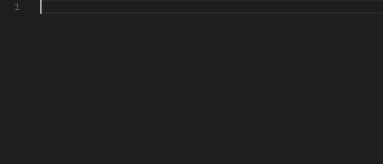

# Visual Studio Code 中的片段


代码片段是可以更轻松地输入重复代码模式（例如循环或条件语句）的模板。

在 Visual Studio Code 中，代码片段出现在 IntelliSense ( Ctrl+Space ) 中，与其他建议混合在一起，以及专用的代码片段选择器（在命令面板中**插入代码片段**）。还支持制表符完成：使用`"editor.tabCompletion": "on"`启用它，输入**代码片段前缀**（触发文本），然后按Tab 键插入代码片段。

代码片段语法遵循[TextMate 代码片段语法](https://manual.macromates.com/en/snippets)，但“插入的 shell 代码”和`\u`的使用除外；两者都不支持。



## [ 内置片段](https://code.visualstudio.com/docs/editor/userdefinedsnippets#_builtin-snippets)

VS Code 具有多种语言的内置代码片段，例如：JavaScript、TypeScript、Markdown 和 PHP。


您可以通过运行命令面板中的**插入片段**命令来查看某种语言的可用片段，以获取当前文件语言的片段列表。但是，请记住，此列表还包括您定义的用户片段以及您安装的扩展程序提供的任何片段。

## [从市场安装片段](https://code.visualstudio.com/docs/editor/userdefinedsnippets#_install-snippets-from-the-marketplace)

[VS Code Marketplace](https://marketplace.visualstudio.com/vscode)上的许多[扩展](https://code.visualstudio.com/docs/editor/extension-marketplace)都包含代码片段。您可以使用`@category:"snippets"`过滤器在扩展程序视图 ( Ctrl+Shift+X ) 中搜索包含代码段的扩展程序。


如果您找到想要使用的扩展，请安装它，然后重新启动 VS Code，新的代码片段将可用。

## [ 创建您自己的片段](https://code.visualstudio.com/docs/editor/userdefinedsnippets#_create-your-own-snippets)

您可以轻松定义自己的片段，无需任何扩展。要创建或编辑您自己的代码段，请选择**“文件**>**首选项”**下的**“配置用户代码段”** ，然后选择代码段应显示的语言（按[语言标识符](https://code.visualstudio.com/docs/languages/identifiers)），或者如果应为所有语言显示代码段，则选择**“新建全局代码段文件”**选项。 VS Code 为您管理底层代码片段文件的创建和刷新。


片段文件以 JSON 编写，支持 C 风格注释，并且可以定义无限数量的片段。片段支持大多数 TextMate 动态行为语法，根据插入上下文智能格式化空白，并允许轻松进行多行编辑。

下面是 JavaScript 的`for`循环片段的示例：

```
// in file 'Code/User/snippets/javascript.json'
{
  "For Loop": {
    "prefix": ["for", "for-const"],
    "body": ["for (const ${2:element} of ${1:array}) {", "\t$0", "}"],
    "description": "A for loop."
  }
}
```

 在上面的例子中：

- “For Loop”是代码片段名称。如果未提供`description` ，则通过 IntelliSense 显示。
- `prefix`定义一个或多个在 IntelliSense 中显示代码片段的触发词。子字符串匹配是在前缀上执行的，因此在这种情况下，“fc”可以匹配“for-const”。
- `body`是一行或多行内容，插入时将合并为多行。换行符和嵌入选项卡将根据插入代码片段的上下文进行格式化。
- `description`是 IntelliSense 显示的代码片段的可选描述。

此外，上面示例的`body`具有三个占位符（按遍历顺序列出）： `${1:array}` 、 `${2:element}`和`$0` 。您可以使用Tab快速跳转到下一个占位符，此时您可以编辑占位符或跳转到下一个占位符。冒号`:` （如果有）后面的字符串是默认文本，例如`${2:element}`中的`element` 。占位符遍历顺序是按数字升序，从1开始；零是一个可选的特殊情况，始终出现在最后，并且退出片段模式并将光标置于指定位置。

### [ 文件模板片段](https://code.visualstudio.com/docs/editor/userdefinedsnippets#_file-template-snippets)

如果代码片段旨在填充或替换文件的内容，则可以将`isFileTemplate`属性添加到代码片段的定义中。当您在新文件或现有文件中运行**“代码段：从代码段填充文件”**命令时，文件模板代码段将显示在下拉列表中。

## [ 片段范围](https://code.visualstudio.com/docs/editor/userdefinedsnippets#_snippet-scope)

片段的范围是有限的，以便仅建议相关的片段。片段的范围可以通过以下任一方式确定：

1. 代码片段范围内的**语言**（可能是全部）
2. 片段范围内的**项目**（可能是全部）

### [ 语言片段范围](https://code.visualstudio.com/docs/editor/userdefinedsnippets#_language-snippet-scope)

每个代码片段的作用域是一种、几种或所有（“全局”）语言，具体取决于它是否在以下语言中定义：

1. **语言**片段文件
2. **全局**片段文件

单语言用户定义的代码片段在特定语言的代码片段文件（例如`javascript.json` ）中定义，您可以通过**代码片段：配置用户代码片段**通过语言标识符访问该文件。仅当编辑定义片段的语言时才能访问片段。

多语言和全局用户定义的代码片段均在“全局”代码片段文件（文件后缀为`.code-snippets` JSON）中定义，也可以通过**代码片段：配置用户代码片段**进行访问。在全局代码片段文件中，代码片段定义可能具有附加的`scope`属性，该属性采用一个或多个[语言标识符](https://code.visualstudio.com/docs/languages/identifiers)，这使得代码片段仅适用于那些指定的语言。如果没有给出`scope`属性，则全局代码片段在**所有**语言中都可用。

大多数用户定义的代码片段的范围仅限于单一语言，因此是在特定于语言的代码片段文件中定义的。

### [ 项目片段范围](https://code.visualstudio.com/docs/editor/userdefinedsnippets#_project-snippet-scope)

您还可以拥有一个范围仅限于您的项目的全局代码片段文件（带有文件后缀`.code-snippets` JSON）。项目文件夹片段是使用**“新片段”文件**创建的**'...****片段中的选项：配置用户片段**下拉菜单，位于项目根目录的`.vscode`文件夹中。项目片段文件对于与在该项目中工作的所有用户共享片段非常有用。项目文件夹片段与全局片段类似，可以通过`scope`属性将范围限定为特定语言。

## [ 片段语法](https://code.visualstudio.com/docs/editor/userdefinedsnippets#_snippet-syntax)

代码片段的`body`可以使用特殊的结构来控制光标和插入的文本。以下是支持的功能及其语法：

### [ 制表位](https://code.visualstudio.com/docs/editor/userdefinedsnippets#_tabstops)

使用制表位，您可以使编辑器光标在代码片段内移动。使用`$1` , `$2`指定光标位置。该数字是访问制表符的顺序，而`$0`表示最终的光标位置。同一制表符的多次出现会被链接并同步更新。

### [ 占位符](https://code.visualstudio.com/docs/editor/userdefinedsnippets#_placeholders)

占位符是带有值的制表位，例如`${1:foo}` 。将插入并选择占位符文本，以便可以轻松更改。占位符可以嵌套，例如`${1:another ${2:placeholder}}` 。

### [ 选择](https://code.visualstudio.com/docs/editor/userdefinedsnippets#_choice)

占位符可以有选择作为值。语法是以逗号分隔的值枚举，并用管道字符括起来，例如`${1|one,two,three|}` 。插入代码片段并选择占位符后，选项将提示用户选择其中一个值。

### [ 变量](https://code.visualstudio.com/docs/editor/userdefinedsnippets#_variables)

使用`$name`或`${name:default}` ，您可以插入变量的值。当未设置变量时，将插入其**默认值**或空字符串。当变量未知（即未定义其名称）时，将插入变量的名称并将其转换为占位符。

可以使用以下变量：

- `TM_SELECTED_TEXT`当前选择的文本或空字符串
- `TM_CURRENT_LINE`当前行的内容
- `TM_CURRENT_WORD`光标所在单词或空字符串的内容
- `TM_LINE_INDEX`基于零索引的行号
- `TM_LINE_NUMBER`基于单索引的行号
- `TM_FILENAME`当前文档的文件名
- `TM_FILENAME_BASE`当前文档的文件名（不带扩展名）
- `TM_DIRECTORY`当前文档的目录
- `TM_FILEPATH`当前文档的完整文件路径
- `RELATIVE_FILEPATH`当前文档的相对（相对于打开的工作区或文件夹）文件路径
- `CLIPBOARD`剪贴板的内容
- `WORKSPACE_NAME`打开的工作空间或文件夹的名称
- `WORKSPACE_FOLDER`打开的工作空间或文件夹的路径
- `CURSOR_INDEX`基于零索引的游标编号
- `CURSOR_NUMBER`基于单索引的游标编号

要插入当前日期和时间：

- `CURRENT_YEAR`当前年份
- `CURRENT_YEAR_SHORT`当前年份的最后两位数字
- `CURRENT_MONTH`两位数的月份（例如“02”）
- `CURRENT_MONTH_NAME`月份的全名（例如“July”）
- `CURRENT_MONTH_NAME_SHORT`月份的简称（例如“Jul”）
- `CURRENT_DATE`两位数表示的月份日期（例如“08”）
- `CURRENT_DAY_NAME`日期名称（例如“星期一”）
- `CURRENT_DAY_NAME_SHORT`当日的简称（例如“星期一”）
- `CURRENT_HOUR` 24 小时制格式的当前小时
- `CURRENT_MINUTE`当前分钟（两位数）
- `CURRENT_SECOND`当前秒数为两位数
- `CURRENT_SECONDS_UNIX`自 Unix 纪元以来的秒数
- `CURRENT_TIMEZONE_OFFSET`当前 UTC 时区偏移量为`+HH:MM`或`-HH:MM` （例如`-07:00` ）。

对于插入随机值：

- `RANDOM` 6 个随机的 10 进制数字
- `RANDOM_HEX` 6 个随机 Base-16 数字
- `UUID`版本 4 UUID

要插入行注释或块注释，请遵循当前语言：

- `BLOCK_COMMENT_START`示例输出：PHP `/*`或 HTML `<!--`
- `BLOCK_COMMENT_END`示例输出：PHP `*/`或 HTML `-->`
- `LINE_COMMENT`示例输出：在 PHP 中`//`

下面的代码片段在 JavaScript 文件中插入`/* Hello World */`在 HTML 文件中插入`<!-- Hello World -->` ：

```
{
  "hello": {
    "scope": "javascript,html",
    "prefix": "hello",
    "body": "$BLOCK_COMMENT_START Hello World $BLOCK_COMMENT_END"
  }
}
```

### [ 变量变换](https://code.visualstudio.com/docs/editor/userdefinedsnippets#_variable-transforms)

转换允许您在插入变量之前修改变量的值。变换的定义由三部分组成：

1. 与变量值匹配的正则表达式，或者当变量无法解析时为空字符串。
2. 允许从正则表达式引用匹配组的“格式字符串”。格式字符串允许条件插入和简单修改。
3. 传递给正则表达式的选项。

以下示例插入当前文件的名称（不带结尾），因此从`foo.txt`生成`foo` 。

```
${TM_FILENAME/(.*)\\..+$/$1/}
  |           |         |  |
  |           |         |  |-> no options
  |           |         |
  |           |         |-> references the contents of the first
  |           |             capture group
  |           |
  |           |-> regex to capture everything before
  |               the final `.suffix`
  |
  |-> resolves to the filename
```

### [ 占位符变换](https://code.visualstudio.com/docs/editor/userdefinedsnippets#_placeholdertransform)

与变量转换类似，占位符的转换允许在移动到下一个制表位时更改占位符的插入文本。插入的文本与正则表达式匹配，并且匹配项或多个匹配项（取决于选项）将替换为指定的替换格式文本。每次出现的占位符都可以使用第一个占位符的值独立定义自己的转换。占位符转换的格式与变量转换的格式相同。

### [ 变换示例](https://code.visualstudio.com/docs/editor/userdefinedsnippets#_transform-examples)

这些示例显示在双引号内，因为它们将出现在代码片段正文中，以说明需要对某些字符进行双重转义。文件名`example-123.456-TEST.js`的示例转换和结果输出。

| 例子                                  | 输出                      | 解释                  |
| :------------------------------------ | :------------------------ | :-------------------- |
| `"${TM_FILENAME/[\\.]/_/}"`           | `example-123_456-TEST.js` | 替换第一个`.`和`_`    |
| `"${TM_FILENAME/[\\.-]/_/g}"`         | `example_123_456_TEST_js` | 替换每个`.`或`-`与`_` |
| `"${TM_FILENAME/(.*)/${1:/upcase}/}"` | `EXAMPLE-123.456-TEST.JS` | 改为全部大写          |
| `"${TM_FILENAME/[^0-9a-z]//gi}"`      | `example123456TESTjs`     | 删除非字母数字字符    |

### [ 语法](https://code.visualstudio.com/docs/editor/userdefinedsnippets#_grammar)

下面是片段的 EBNF（[扩展巴科斯-诺尔形式](https://en.wikipedia.org/wiki/Extended_Backus-Naur_form)）。使用`\` （反斜杠），您可以转义`$` 、 `}`和`\` 。在选择元素中，反斜杠也会转义逗号和竖线字符。只有需要转义的字符才可以转义，因此`$`不应在这些构造中转义，并且`$`或`}`都不应在 choice 构造中转义。

```
any         ::= tabstop | placeholder | choice | variable | text
tabstop     ::= '$' int
                | '${' int '}'
                | '${' int  transform '}'
placeholder ::= '${' int ':' any '}'
choice      ::= '${' int '|' text (',' text)* '|}'
variable    ::= '$' var | '${' var '}'
                | '${' var ':' any '}'
                | '${' var transform '}'
transform   ::= '/' regex '/' (format | text)+ '/' options
format      ::= '$' int | '${' int '}'
                | '${' int ':' '/upcase' | '/downcase' | '/capitalize' | '/camelcase' | '/pascalcase' '}'
                | '${' int ':+' if '}'
                | '${' int ':?' if ':' else '}'
                | '${' int ':-' else '}' | '${' int ':' else '}'
regex       ::= JavaScript Regular Expression value (ctor-string)
options     ::= JavaScript Regular Expression option (ctor-options)
var         ::= [_a-zA-Z] [_a-zA-Z0-9]*
int         ::= [0-9]+
text        ::= .*
if          ::= text
else        ::= text
```

## [ 使用 TextMate 片段](https://code.visualstudio.com/docs/editor/userdefinedsnippets#_using-textmate-snippets)

您还可以将现有的 TextMate 代码片段 (.tmSnippets) 与 VS Code 结合使用。请参阅我们的扩展 API 部分中的[使用 TextMate 片段](https://code.visualstudio.com/api/language-extensions/snippet-guide#_using-textmate-snippets)主题以了解更多信息。

## [将键绑定分配给片段](https://code.visualstudio.com/docs/editor/userdefinedsnippets#_assign-keybindings-to-snippets)

您可以创建自定义[键绑定](https://code.visualstudio.com/docs/getstarted/keybindings)来插入特定片段。打开`keybindings.json` （**首选项：打开键盘快捷键文件**），它定义了所有键绑定，并添加一个传递`"snippet"`作为额外参数的键绑定：

```
{
  "key": "cmd+k 1",
  "command": "editor.action.insertSnippet",
  "when": "editorTextFocus",
  "args": {
    "snippet": "console.log($1)$0"
  }
}
```

键绑定将调用**“插入片段”**命令，但不会提示您选择片段，而是插入提供的片段。您可以像往常一样使用键盘快捷键、命令 ID 和启用键盘快捷键时的可选[when 子句上下文](https://code.visualstudio.com/docs/getstarted/keybindings#_when-clause-contexts)来定义自定义[键](https://code.visualstudio.com/docs/getstarted/keybindings)绑定。

此外，您可以使用`langId`和`name`参数引用现有代码片段，而不是使用`snippet`参数值来定义内联代码片段。 `langId`参数选择插入由`name`表示的代码片段的语言，例如下面的示例选择可用于`csharp`文件的`myFavSnippet` 。

```
{
  "key": "cmd+k 1",
  "command": "editor.action.insertSnippet",
  "when": "editorTextFocus",
  "args": {
    "langId": "csharp",
    "name": "myFavSnippet"
  }
}
```

## [ 后续步骤](https://code.visualstudio.com/docs/editor/userdefinedsnippets#_next-steps)

- [命令行](https://code.visualstudio.com/docs/editor/command-line)- VS Code 具有丰富的命令行界面，可用于打开或比较文件以及安装扩展。
- [扩展 API](https://code.visualstudio.com/api) - 了解扩展 VS Code 的其他方法。
- [代码片段指南](https://code.visualstudio.com/api/language-extensions/snippet-guide)- 您可以打包代码片段以在 VS Code 中使用。

## [ 常见问题](https://code.visualstudio.com/docs/editor/userdefinedsnippets#_common-questions)

### [如果我想使用 .tmSnippet 文件中的现有 TextMate 片段怎么办？](https://code.visualstudio.com/docs/editor/userdefinedsnippets#_what-if-i-want-to-use-existing-textmate-snippets-from-a-tmsnippet-file)

您可以轻松打包 TextMate 片段文件以在 VS Code 中使用。请参阅我们的扩展 API 文档中的[使用 TextMate 片段](https://code.visualstudio.com/api/language-extensions/snippet-guide#_using-textmate-snippets)。

### [如何让代码片段在粘贴的脚本中放置变量？](https://code.visualstudio.com/docs/editor/userdefinedsnippets#_how-do-i-have-a-snippet-place-a-variable-in-the-pasted-script)

要在粘贴的脚本中包含变量，您需要转义`$variable`名称的“$”，以便代码片段扩展阶段不会对其进行解析。

```
"VariableSnippet":{
    "prefix": "_Var",
    "body": "\\$MyVar = 2",
    "description": "A basic snippet that places a variable into script with the $ prefix"
  }
```

这导致粘贴的代码片段如下：

```
$MyVar = 2
```

### [我可以从 IntelliSense 中删除片段吗？](https://code.visualstudio.com/docs/editor/userdefinedsnippets#_can-i-remove-snippets-from-intellisense)

是的，您可以通过选择**“插入代码段”**命令下拉列表中代码段项右侧的**“从 IntelliSense 隐藏”**按钮来隐藏特定代码段，使其不显示在 IntelliSense（完成列表）中。


您仍然可以使用**“插入代码段”**命令选择代码段，但隐藏的代码段不会显示在 IntelliSense 中。