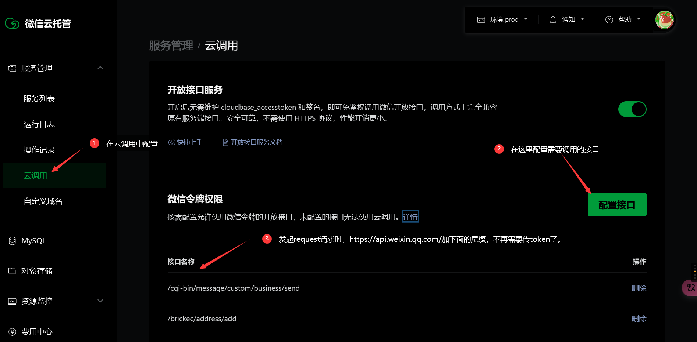
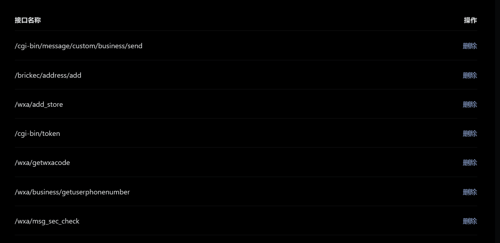
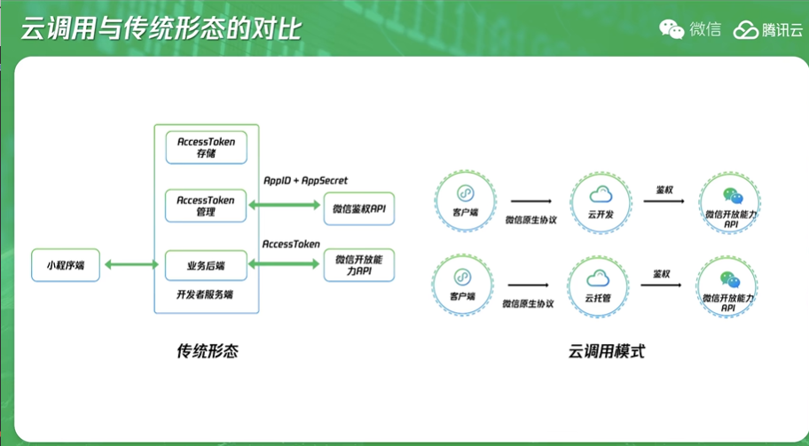

## 配置云调用权限

「开放接口服务(简称:接口)」以旁加载形式部署到服务中，占用资源和内存极小，与业务服务共用资源。开放接口服务中转 `api.weixin.qq.com` 的请求，并自动处理 `token` 和鉴权问题。

前往[控制台-云调用-云调用权限配置](https://cloud.weixin.qq.com/cloudrun/openapi)，按照自己的业务需要配置接口。新版云调用和旧版云调用都需要配置权限。

配置时只需要配置接口路径，一个接口一行，配置完点击输入框下「保存」按钮，使配置生效，保存后，环境下所有的服务都可以免鉴权调用在此配置的接口。

比如你要在服务中调用[文字安全检测接口](https://developers.weixin.qq.com/miniprogram/dev/framework/security.msgSecCheck-v1.html)

检查一段文本是否含有违法违规内容。

应用场景举例：

1. 用户个人资料违规文字检测；
2. 媒体新闻类用户发表文章，评论内容检测；
3. 游戏类用户编辑上传的素材(如答题类小游戏用户上传的问题及答案)检测等。 *频率限制：单个 appId 调用上限为 4000 次/分钟，2,000,000 次/天**

此接口的调用地址如下：

```bash
https://api.weixin.qq.com/wxa/msg_sec_check?access_token=ACCESS_TOKEN
```

在配置时，只需要 `api.weixin.qq.com` 之后，`?`参数之前的部分，所以应该在配置输入框里填写如下：

```bash
/wxa/msg_sec_check
```





调用微信的各种接口能实现各个功能，极大的丰富了后端的功能，加上npm中下载的包，后端的功能将会特别强大。

1. 查看[服务端接口](https://developers.weixin.qq.com/miniprogram/dev/api-backend/)的文档。容器内云调用形式与原有接口文档相同，但不需要携带接口调用凭证（`access_token` 和 `cloudbase_access_token`）。

配置好接口后，使用形式与传统方式相同，只是不需携带access_token，下面拿nodejs举例子，举一反三理解：

```js
const fs = require('fs')
const request = require('request')
return new Promise((resolve, reject) => {
  request({
    method: 'POST',
    // url: 'http://api.weixin.qq.com/wxa/msg_sec_check?access_token=TOKEN',
    url: 'http://api.weixin.qq.com/wxa/msg_sec_check', // 这里就是少了一个token
    body: JSON.stringify({
      openid: '用户的openid', // 可以从请求的header中直接获取 req.headers['x-wx-openid']
      version: 2,
      scene: 2,
      content: '安全检测文本'
    })
  },function (error, response) {
    console.log('接口返回内容', response.body)
    resolve(JSON.parse(response.body))
  })
})
```

使用腾讯云托管服务无需传入token，无需关心鉴权 ; 如果使用其他的云托管服务(阿里云等等)就需要传入token鉴权了，即需要下载证书使用函数来生成token。



​	