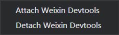
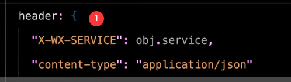
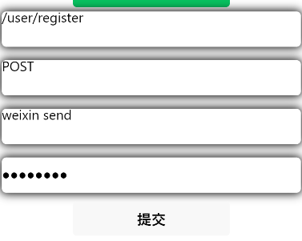
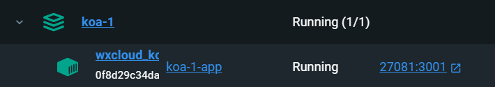
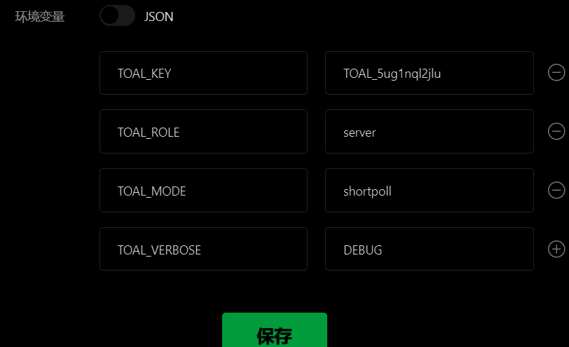
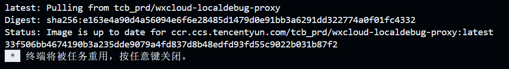
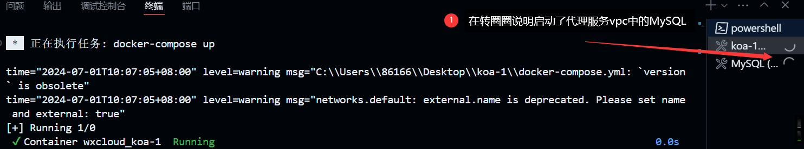
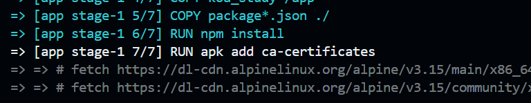

> 注意本地调试一样要配置接口，否则无法访问接口 [免鉴权接口配置](C:\Users\86166\Desktop\koa-1\学习笔记\微信小程序\免鉴权接口配置.md)

首先打开容器，在容器名字上单击鼠标右键，选择`Attach Weixin Devtools`就能开启微信开发者工具中的本地调试。




使用本地调试时,微信小程序开发者工具中，在`wx.cloud.callcontainer`的头部配置中，`X-WX-SERVICE`中设置为本地容器的名字，不再使用云端的容器的名字，就能实现在本地调试。



向本地调试的服务器发送数据，不需要使用`http://127.0.0.1:40461/user/register`完整域名，只需要使用`/user/register`就行。




> 虽然是本地调试，但是数据还是写到云端数据库的。
>

连接不上数据库的原因，经过测试，和`v2ray`是是否开启代理无关。`------(这个时候的认识是迷糊的,但是触及到了问题点,只是不确定)`

`vscode`中的容器，`start`是启动的普通容器，不会监听代码变更而实时更新，`live coding`会实时监听代码变更而实时更新服务器，因而无需频繁的使用docker build重新构建容器，这比启动普通的容器方便多了。


仔细观察,会发嵌套了两层，有两层框架，这就为什么会实时更新的原因了，不过也更耗CPU了。



 内网地址`  "domain": "eoixleqv.koa-q901.4om1h0kq.3kgaaf8f.com",`测试这个配置是否对连接数据库的影响。

经测试对数据库的连接是毫无影响的。


> 或许问题出在vpc的配置上`-----(此时的认识渐渐清晰)`，云端`TOAL_KEY=TOAL_bmfd2y2j7tq`一天会自动变化好几次，本地的`TOAL_KEY=TOAL_bmfd2y2j7tq`也会自动变得一致。
>





`请解释一下`:                               `------(开始研究日志了,只不过还是不确定研究的目标)`

```sh
正在执行任务: docker run  --rm -d --network wxcb0 --ip [10.2.114.172](http://10.2.114.172) --pull=always 
-e TOAL_ROLE=client 
-e TOAL_SERVER=https://wxcloud-localdebug-proxy-109508-4-1326387808.sh.run.tcloudbase.com:443 
-e TOAL_KEY=TOAL_bmfd2y2j7tq 
-e TOAL_SERVER_TIMEOUT=200 
-e TOAL_MODE=shortpoll 
-e TOAL_LOCAL_PORT=3306 
-e TOAL_TARGET=[10.2.114.172:3306](http://10.2.114.172:3306) 
-e TOAL_VERBOSE=DEBUG 
-l role=vpcdebugproxy 
-l wxcloud=[10.2.114.172:3306](http://10.2.114.172:3306) 
-l ip=[10.2.114.172](http://10.2.114.172) [ccr.ccs.tencentyun.com/tcb_prd/wxcloud-localdebug-proxy:latest](http://ccr.ccs.tencentyun.com/tcb_prd/wxcloud-localdebug-proxy:latest)  

latest: Pulling from tcb_prd/wxcloud-localdebug-proxy 

Digest: sha256:e163e4a90d4a56094e6f6e28485d1479d0e91bb3a6291dd322774a0f01fc4332 

Status: Image is up to date for [ccr.ccs.tencentyun.com/tcb_prd/wxcloud-localdebug-proxy:latest](http://ccr.ccs.tencentyun.com/tcb_prd/wxcloud-localdebug-proxy:latest) 3f85263dd22cca54dcf0ee39d34e4dc434fbe427f53d350a44c34af7362f5d2e
*  终端将被任务重用，按任意键关闭。   


*  正在执行任务: docker run  --rm -d --network wxcb0 --name [api.weixin.qq.com](http://api.weixin.qq.com) --pull=always 
-e TOAL_ROLE=client 
-e TOAL_SERVER=https://wxcloud-localdebug-proxy-109508-4-1326387808.sh.run.tcloudbase.com:443 
-e TOAL_KEY=TOAL_bmfd2y2j7tq 
-e TOAL_SERVER_TIMEOUT=200 
-e TOAL_MODE=shortpoll 
-e TOAL_LOCAL_PORT=80 
-e TOAL_TARGET=[api.weixin.qq.com](http://api.weixin.qq.com) 
-e TOAL_VERBOSE=DEBUG 
-l role=vpcdebugproxy 
-l wxcloud=[api.weixin.qq.com](http://api.weixin.qq.com) 
-l domain=[api.weixin.qq.com](http://api.weixin.qq.com) [ccr.ccs.tencentyun.com/tcb_prd/wxcloud-localdebug-proxy:latest](http://ccr.ccs.tencentyun.com/tcb_prd/wxcloud-localdebug-proxy:latest)  

latest: Pulling from tcb_prd/wxcloud-localdebug-proxy 

Digest: sha256:e163e4a90d4a56094e6f6e28485d1479d0e91bb3a6291dd322774a0f01fc4332 

Status: Image is up to date for [ccr.ccs.tencentyun.com/tcb_prd/wxcloud-localdebug-proxy:latest](http://ccr.ccs.tencentyun.com/tcb_prd/wxcloud-localdebug-proxy:latest) 23fb59421904e78b1f04b29a9f338ab3965aa1c6381115afd377066780d3e563 *  终端将被任务重用，按任意键关闭。
```


这段输出显示了两个正在执行的 `docker run` 命令，它们分别启动了两个Docker容器，用于本地调试和连接腾讯云内网资源。以下是对这段输出的详细解释：

```sh
docker run --rm -d --network wxcb0 --ip 10.2.114.172 --pull=always 
-e TOAL_ROLE=client 
-e TOAL_SERVER=https://wxcloud-localdebug-proxy-109508-4-1326387808.sh.run.tcloudbase.com:443 
-e TOAL_KEY=TOAL_bmfd2y2j7tq 
-e TOAL_SERVER_TIMEOUT=200 
-e TOAL_MODE=shortpoll 
-e TOAL_LOCAL_PORT=3306 
-e TOAL_TARGET=10.2.114.172:3306 
-e TOAL_VERBOSE=DEBUG 
-l role=vpcdebugproxy 
-l wxcloud=10.2.114.172:3306 
-l ip=10.2.114.172 ccr.ccs.tencentyun.com/tcb_prd/wxcloud-localdebug-proxy:latest
```

\#### 参数解释：

- `--rm`：容器退出后自动删除。

- `-d`：以守护进程模式运行容器。

- `--network wxcb0`：指定容器使用的网络为 `wxcb0`。

- `--ip 10.2.114.172`：指定容器的IP地址为 `10.2.114.172`。

- `--pull=always`：总是拉取最新的镜像版本。

- `-e TOAL_ROLE=client`：设置环境变量 `TOAL_ROLE` 为 `client`。

- `-e TOAL_SERVER=https://wxcloud-localdebug-proxy-109508-4-1326387808.sh.run.tcloudbase.com:443`：设置环境变量 `TOAL_SERVER` 为指定的服务器地址。

- `-e TOAL_KEY=TOAL_bmfd2y2j7tq`：设置环境变量 `TOAL_KEY` 为指定的密钥。

- `-e TOAL_SERVER_TIMEOUT=200`：设置环境变量 `TOAL_SERVER_TIMEOUT` 为 200 毫秒。

- `-e TOAL_MODE=shortpoll`：设置环境变量 `TOAL_MODE` 为 `shortpoll` 模式。

- `-e TOAL_LOCAL_PORT=3306`：设置环境变量 `TOAL_LOCAL_PORT` 为 3306。

- `-e TOAL_TARGET=10.2.114.172:3306`：设置环境变量 `TOAL_TARGET` 为 `10.2.114.172:3306`。

- `-e TOAL_VERBOSE=DEBUG`：设置环境变量 `TOAL_VERBOSE` 为 `DEBUG`，启用调试日志。

- `-l role=vpcdebugproxy`：设置标签 `role` 为 `vpcdebugproxy`。

- `-l wxcloud=10.2.114.172:3306`：设置标签 `wxcloud` 为 `10.2.114.172:3306`。

- `-l ip=10.2.114.172`：设置标签 `ip` 为 `10.2.114.172`。

- `ccr.ccs.tencentyun.com/tcb_prd/wxcloud-localdebug-proxy:latest`：使用腾讯云镜像仓库中的 `wxcloud-localdebug-proxy` 镜像的最新版本。

\### 第二条 `docker run` 命令

```shell
docker run --rm -d --network wxcb0 --name api.weixin.qq.com --pull=always 
-e TOAL_ROLE=client 
-e TOAL_SERVER=https://wxcloud-localdebug-proxy-109508-4-1326387808.sh.run.tcloudbase.com:443 
-e TOAL_KEY=TOAL_bmfd2y2j7tq 
-e TOAL_SERVER_TIMEOUT=200 
-e TOAL_MODE=shortpoll 
-e TOAL_LOCAL_PORT=80 
-e TOAL_TARGET=api.weixin.qq.com 
-e TOAL_VERBOSE=DEBUG 
-l role=vpcdebugproxy 
-l wxcloud=api.weixin.qq.com 
-l domain=api.weixin.qq.com ccr.ccs.tencentyun.com/tcb_prd/wxcloud-localdebug-proxy:latest
```

\#### 参数解释：

- `--rm`：容器退出后自动删除。

- `-d`：以守护进程模式运行容器。

- `--network wxcb0`：指定容器使用的网络为 `wxcb0`。

- `--name api.weixin.qq.com`：指定容器的名称为 `api.weixin.qq.com`。

- `--pull=always`：总是拉取最新的镜像版本。

- `-e TOAL_ROLE=client`：设置环境变量 `TOAL_ROLE` 为 `client`。

- `-e TOAL_SERVER`=`https://wxcloud-localdebug-proxy-109508-4-1326387808.sh.run.tcloudbase.com:443`

  ：设置环境变量 `TOAL_SERVER` 为指定的服务器地址。

- `-e TOAL_KEY=TOAL_bmfd2y2j7tq`：设置环境变量 `TOAL_KEY` 为指定的密钥。

- `-e TOAL_SERVER_TIMEOUT=200`：设置环境变量 `TOAL_SERVER_TIMEOUT` 为 200 毫秒。

- `-e TOAL_MODE=shortpoll`：设置环境变量 `TOAL_MODE` 为 `shortpoll` 模式。

- `-e TOAL_LOCAL_PORT=80`：设置环境变量 `TOAL_LOCAL_PORT` 为 80。

- `-e TOAL_TARGET=api.weixin.qq.com`：设置环境变量 `TOAL_TARGET` 为 `api.weixin.qq.com`。

- `-e TOAL_VERBOSE=DEBUG`：设置环境变量 `TOAL_VERBOSE` 为 `DEBUG`，启用调试日志。

- `-l role=vpcdebugproxy`：设置标签 `role` 为 `vpcdebugproxy`。

- `-l wxcloud=api.weixin.qq.com`：设置标签 `wxcloud` 为 `api.weixin.qq.com`。

- `-l domain=api.weixin.qq.com`：设置标签 `domain` 为 `api.weixin.qq.com`。

- `ccr.ccs.tencentyun.com/tcb_prd/wxcloud-localdebug-proxy:latest`：使用腾讯云镜像仓库中的 `wxcloud-localdebug-proxy` 镜像的最新版本。

\### 总结
这两个 `docker run` 命令启动了两个容器，它们分别用于本地调试并连接到腾讯云内网的不同资源。通过设置各种环境变量和标签，这些容器能够与腾讯云的本地调试代理进行通信，并且在调试过程中提供详细的日志信息（DEBUG模式）。


腾讯云本地调试vps连接MySQL，会把内网地址转换为外网地址，然后验证用户名和密码，对吗？

在腾讯云本地调试环境中，通过VPC连接内网MySQL时，确实涉及到一些网络和身份验证的转换和处理。以下是详细的解释：

\### 1. 内网地址和外网地址的转换
在本地调试环境中，通常会通过一个代理或隧道将本地请求转发到云上的内网资源。这意味着：

- 本地请求：你在本地开发环境中发出的请求会被代理或隧道捕获。

- 代理转发：代理会将这些请求转发到云上的内网资源（如MySQL实例）。

- 内网访问：在云上，代理会使用内网地址访问MySQL。

\### 2. 用户名和密码验证
当请求到达MySQL实例时，MySQL会执行标准的身份验证过程：

- 接收请求：MySQL实例接收到来自代理的连接请求。

- 验证用户：MySQL实例会根据请求中的用户名和密码进行验证。

- 授权检查：MySQL会检查该用户是否有权限访问请求的数据库和表。

\### 具体流程
以下是一个简化的流程图，描述了本地调试环境中通过VPC连接MySQL的过程：

1. 本地开发环境：

- 你在本地代码中配置了MySQL的连接信息（如内网IP地址、端口、用户名和密码）。

- 你启动调试代理（如Docker容器），该代理配置了相关的环境变量（如`TOAL_LOCAL_PORT`、`TOAL_TARGET`等）。

1. 代理捕获请求：

- 你在本地运行应用程序，应用程序尝试连接MySQL。

- 代理捕获到连接请求，并将其转发到云上的调试代理服务器。

1. 调试代理服务器：

- 调试代理服务器接收到请求，并根据配置将其转发到MySQL实例的内网地址。

1. MySQL实例：

- MySQL实例接收到来自调试代理服务器的请求。

- MySQL执行标准的身份验证过程，验证用户名和密码。

- 如果验证通过，MySQL允许连接并处理请求。

\### 配置示例
假设你在VSCode中进行调试，以下是一个配置示例：

\#### VSCode Launch Configuration

```json
{
  "version": "0.2.0",
  "configurations": [
    {
      "type": "node",
      "request": "launch",
      "name": "Launch Program",
      "skipFiles": ["<node_internals>/**"],
      "program": "${workspaceFolder}/app.js",
      "env": {
        "TOAL_LOCAL_PORT": "3306",
        "TOAL_TARGET": "10.2.114.172:3306",
        "TOAL_VERBOSE": "DEBUG"
      },
      "runtimeExecutable": "npm",
      "runtimeArgs": ["run", "dev"]
    }
  ]
}
```

\#### Docker Run Command

```sh
docker run --rm -d --network wxcb0 --ip 10.2.114.172 --pull=always 
-e TOAL_ROLE=client 
-e TOAL_SERVER=https://wxcloud-localdebug-proxy-109508-4-1326387808.sh.run.tcloudbase.com:443 
-e TOAL_KEY=TOAL_bmfd2y2j7tq 
-e TOAL_SERVER_TIMEOUT=200 
-e TOAL_MODE=shortpoll 
-e TOAL_LOCAL_PORT=3306 
-e TOAL_TARGET=10.2.114.172:3306 
-e TOAL_VERBOSE=DEBUG 
-l role=vpcdebugproxy 
-l wxcloud=10.2.114.172:3306 
-l ip=10.2.114.172 ccr.ccs.tencentyun.com/tcb_prd/wxcloud-localdebug-proxy:latest
```

\### 注意事项

- 安全组配置：确保MySQL实例的安全组配置允许来自代理的入站流量。

- 用户权限：确保MySQL用户有足够的权限，并且允许从代理的IP地址进行连接。

- 调试代理配置：确保调试代理的配置正确，特别是`TOAL_LOCAL_PORT`和`TOAL_TARGET`等环境变量。

\### 结论
在腾讯云本地调试环境中，通过VPC连接内网MySQL时，代理会将本地请求转发到云上的内网地址，然后MySQL实例会执行标准的用户名和密码验证过程。确保配置正确，可以顺利进行本地调试和连接。

`-----(没有找到问题点,研究方向乱了)`

> 待验证: 是否和`docker-compose.yml`文件手动保存是否相关，初始化的时候会生成:
>
> ```javascript
>  environment:
>       - MYSQL_USERNAME=
>       - MYSQL_PASSWORD=
>       - MYSQL_ADDRESS=
>       - MYSQL_USERNAME=root
>       - MYSQL_PASSWORD=Wuqy199511
>       - MYSQL_ADDRESS=10.2.114.172:3306
> ```
>
> 然后手动删除了多余的:
>
> ```javascript
>     environment:
>       - MYSQL_USERNAME=root
>       - MYSQL_PASSWORD=Wuqy199511
>       - MYSQL_ADDRESS=10.2.114.172:3306
> ```
>
> 之前都是没有手动保存，手动按了保存了，重启容器居然数据库连接成功了。

`docker-compose.yml`文件下的配置:

```javascript
version: '3'
services:
  app:
    build:
      context: .
      dockerfile: Dockerfile.development
    volumes:
      - .:/app
      - /app/node_modules
    ports:
      - '27081:3001'
    container_name: wxcloud_koa-1
    labels:
      - wxPort=35079
      - hostPort=27081
      - wxcloud=koa-1
      - role=container
    environment:
      - MYSQL_USERNAME=root
      - MYSQL_PASSWORD=Wuqy199511
      - MYSQL_ADDRESS=10.2.114.172:3306
networks:
  default:
    external:
      name: wxcb0

```


> docker容器内的服务怎么连接vpc?

在 Docker 容器内连接 VPC（Virtual Private Cloud）通常涉及将 Docker 容器配置为能够与 VPC 内的资源进行通信。这可以通过多种方法实现，具体取决于你的网络架构和需求。以下是几种常见的方法：

\### 方法 1：使用 Docker 网络

Docker 提供了多种网络模式，可以帮助容器与外部网络（包括 VPC）进行通信。常见的网络模式包括：

\#### 1.1 Bridge 网络模式

默认情况下，Docker 容器使用 bridge 网络模式。在这种模式下，容器可以通过宿主机的网络接口与外部网络通信。

- 步骤：

1. 启动 Docker 容器时，使用默认的 bridge 网络模式。

1. 在宿主机上配置网络，使其能够与 VPC 内的资源通信。

1. 容器内的服务可以通过宿主机的网络接口访问 VPC 资源。

\#### 1.2 Host 网络模式

在 host 网络模式下，容器将直接使用宿主机的网络接口。这意味着容器将与宿主机共享相同的 IP 地址。

- 步骤：

1. 启动 Docker 容器时，使用 `--network host` 选项：

```sh
docker run --network host <image>
```

1. 容器内的服务将直接使用宿主机的网络接口，可以访问 VPC 内的资源。

\#### 1.3 Overlay 网络模式

如果你使用 Docker Swarm 或 Kubernetes 等编排工具，可以使用 overlay 网络模式，将多个宿主机上的容器连接到同一个虚拟网络中。

- 步骤：

1. 创建一个 overlay 网络：

```sh
docker network create -d overlay my-overlay-network
```

1. 启动容器时，指定使用 overlay 网络：

```sh
docker service create --network my-overlay-network <image>
```

\### 方法 2：使用 VPN 连接

如果你的 VPC 在云服务提供商（如 AWS、GCP、Azure）上，你可以在宿主机上配置 VPN 客户端，使其能够连接到 VPC。

- 步骤：

1. 在宿主机上配置 VPN 客户端，连接到 VPC。

1. 启动 Docker 容器，使其使用宿主机的网络接口。

1. 容器内的服务可以通过宿主机的 VPN 连接访问 VPC 资源。

\### 方法 3：使用云服务提供商的网络服务

如果你的 Docker 容器运行在云服务提供商的环境中，可以使用云服务提供商提供的网络服务（如 AWS VPC、Azure VNet、GCP VPC）来配置网络。

\#### 3.1 AWS VPC

- 步骤：

1. 在 AWS 控制台中，创建一个 VPC 和子网。

1. 在子网中创建 EC2 实例，作为 Docker 容器的宿主机。

1. 在 EC2 实例上安装 Docker，并启动容器。

1. 容器内的服务可以通过 EC2 实例的网络接口访问 VPC 资源。

\#### 3.2 Azure VNet

- 步骤：

1. 在 Azure 门户中，创建一个虚拟网络（VNet）和子网。

1. 在子网中创建虚拟机，作为 Docker 容器的宿主机。

1. 在虚拟机上安装 Docker，并启动容器。

1. 容器内的服务可以通过虚拟机的网络接口访问 VNet 资源。

\#### 3.3 GCP VPC

- 步骤：

1. 在 GCP 控制台中，创建一个 VPC 和子网。

1. 在子网中创建虚拟机实例，作为 Docker 容器的宿主机。

1. 在虚拟机实例上安装 Docker，并启动容器。

1. 容器内的服务可以通过虚拟机实例的网络接口访问 VPC 资源。

\### 总结

连接 Docker 容器到 VPC 可以通过多种方法实现，具体取决于你的网络架构和需求。常见的方法包括使用 Docker 网络模式（如 bridge、host、overlay）、配置 VPN 连接，以及使用云服务提供商的网络服务（如 AWS VPC、Azure VNet、GCP VPC）。选择合适的方法，可以确保 Docker 容器内的服务能够与 VPC 内的资源进行通信。


> 如果3个容器都在同一个network网络下，其中两个容器是vpc的代理服务，另外一个容器要通过这两个容器访问vpc网络，那么该怎么配置?

要在 Docker 中配置一个容器通过另外两个容器作为代理访问 VPC 网络，可以按照以下步骤进行配置。假设有三个容器：`proxy1`、`proxy2` 和 `client`，其中 `proxy1` 和 `proxy2` 是代理服务，`client` 是需要通过代理访问 VPC 网络的容器。

\### 步骤 1：创建 Docker 网络

首先，创建一个自定义的 Docker 网络，使所有容器都在同一个网络中，以便它们可以相互通信。

```sh
docker network create my-network
```

\### 步骤 2：启动代理服务容器

启动两个代理服务容器 `proxy1` 和 `proxy2`，并将它们连接到 `my-network` 网络。假设使用的是一个代理服务镜像（例如 `squid`）。

```sh
docker run -d --name proxy1 --network my-network squid
docker run -d --name proxy2 --network my-network squid
```

\### 步骤 3：配置代理服务

确保代理服务容器 `proxy1` 和 `proxy2` 已正确配置，并且能够访问 VPC 网络。具体配置步骤取决于你使用的代理服务。

\### 步骤 4：启动客户端容器

启动客户端容器 `client`，并将其连接到 `my-network` 网络。

```sh
docker run -d --name client --network my-network my-client-image
```

\### 步骤 5：配置客户端容器使用代理

在客户端容器 `client` 中配置代理设置，使其通过 `proxy1` 和 `proxy2` 访问 VPC 网络。这可以通过设置环境变量或修改配置文件来实现。

\#### 方法 1：设置环境变量

如果客户端应用支持通过环境变量配置代理，可以在启动容器时设置这些环境变量。

```sh
docker run -d --name client --network my-network \
  -e HTTP_PROXY=http://proxy1:3128 \
  -e HTTPS_PROXY=http://proxy1:3128 \
  -e HTTP_PROXY=http://proxy2:3128 \
  -e HTTPS_PROXY=http://proxy2:3128 \
  my-client-image
```

\#### 方法 2：修改配置文件

如果客户端应用需要通过配置文件设置代理，可以在容器内修改相应的配置文件。例如，对于 `curl` 命令，可以在 `/etc/environment` 文件中添加代理配置：

```sh
docker exec -it client /bin/bash
echo "export HTTP_PROXY=http://proxy1:3128" >> /etc/environment
echo "export HTTPS_PROXY=http://proxy1:3128" >> /etc/environment
source /etc/environment
```

\### 步骤 6：测试连接

在客户端容器 `client` 中，测试通过代理访问 VPC 网络的连接。例如，使用 `curl` 命令访问一个 VPC 内的资源：

```sh
docker exec -it client curl http://vpc-resource-url
```

\### 高可用性配置

为了实现高可用性，可以配置负载均衡，使 `client` 容器在 `proxy1` 和 `proxy2` 之间进行负载均衡。可以使用 `haproxy` 或 `nginx` 作为负载均衡器。

\#### 使用 `haproxy` 配置负载均衡

1. 启动 `haproxy` 容器：

```sh
docker run -d --name haproxy --network my-network haproxy
```

1. 配置 `haproxy`，使其在 `proxy1` 和 `proxy2` 之间进行负载均衡。编辑 `haproxy.cfg` 配置文件：

```javascript
frontend http-in
​    bind *:80
​    default_backend proxies

backend proxies
​    balance roundrobin
​    server proxy1 proxy1:3128 check
​    server proxy2 proxy2:3128 check
```

1. 将 `haproxy.cfg` 文件挂载到 `haproxy` 容器：

```sh
docker run -d --name haproxy --network my-network \
  -v /path/to/haproxy.cfg:/usr/local/etc/haproxy/haproxy.cfg \
  haproxy
```


1. 配置客户端容器使用 `haproxy` 作为代理：

```sh
docker run -d --name client --network my-network \
  -e HTTP_PROXY=http://haproxy:80 \
  -e HTTPS_PROXY=http://haproxy:80 \
  my-client-image
```

\### 总结

通过以上步骤，可以配置 Docker 容器 `client` 通过 `proxy1` 和 `proxy2` 代理服务访问 VPC 网络。为了实现高可用性，可以使用 `haproxy` 或 `nginx` 进行负载均衡。根据具体需求选择合适的配置方法，可以确保容器内的服务能够稳定地访问 VPC 内的资源。


# 未关闭v2ray的报错`-------(方向终于对了,同时找到了问题)`

vpc-MySQL日志:`连接失败的报错日志`    `导致错误的原因是未关闭v2ray。`

```sh
[INFO] 7/1/2024, 1:48:49 AM [client zebra-muscle-523] http short poll client created with options {"localIp":"127.0.0.1","localPort":3306,"localProxy":{"protocol":"http","host":"127.0.0.1","port":10809},"toalServer":{"protocol":"https","host":"wxcloud-localdebug-proxy-109508-4-1326387808.sh.run.tcloudbase.com","port":443,"timeout":200},"target":{"host":"10.2.114.172","port":3306},"verbose":"DEBUG","key":"TOAL_gap31nreqv"} 
[DEBUG] 7/1/2024, 1:50:51 AM [client zebra-muscle-523] upstream 0 using local proxy http://127.0.0.1:10809 
[DEBUG] 7/1/2024, 1:50:52 AM [client zebra-muscle-523] [conn zebra-muscle-523_0] new socket established from ::ffff:10.0.0.3:48280 
[ERROR] 7/1/2024, 1:50:55 AM [client zebra-muscle-523] upstream 0 req error RequestError: connect ECONNREFUSED 127.0.0.1:10809 
[DEBUG] 7/1/2024, 1:50:55 AM [client zebra-muscle-523] [conn zebra-muscle-523_0] connection cleaned up 
[DEBUG] 7/1/2024, 1:50:55 AM [client zebra-muscle-523] [conn zebra-muscle-523_0] [msg NaN] local socket on close 
[DEBUG] 7/1/2024, 1:50:55 AM [client zebra-muscle-523] upstream 1 using local proxy http://127.0.0.1:10809 
[DEBUG] 7/1/2024, 1:50:55 AM [client zebra-muscle-523] [conn zebra-muscle-523_0] connection cleaned up 
[ERROR] 7/1/2024, 1:50:58 AM [client zebra-muscle-523] upstream 1 req error RequestError: connect ECONNREFUSED 127.0.0.1:10809
```

这段日志记录了某个客户端（`zebra-muscle-523`）与服务器交互的过程，包括配置信息、连接建立、以及遇到的错误。以下是关键信息的解读：

1. **客户端配置**:
   - 日志时间：2024年7月1日1:48:49 AM。
   - 客户端ID：`zebra-muscle-523`。
   - 配置详情：使用本地IP `127.0.0.1` 和端口 `3306`，通过一个本地代理 (`http://127.0.0.1:10809`) 连接到远程服务器。远程服务器配置为HTTPS协议，地址为`wxcloud-localdebug-proxy-109508-4-1326387808.sh.run.tcloudbase.com`，端口 `443`，超时设置为200毫秒。目标服务位于 `10.2.114.172:3306`，日志级别设置为 `DEBUG`，并有一个特定的键值对 `key: TOAL_gap31nreqv`。
2. **连接建立**:
   - 时间：1:50:51 AM，客户端通过本地代理尝试建立新的连接，并成功从IP `::ffff:10.0.0.3` 的端口 `48280` 建立了到自身的连接。
3. **错误信息**:
   - 时间：1:50:55 AM，客户端尝试通过本地代理 (`http://127.0.0.1:10809`) 连接上游服务时遇到错误，错误类型为 `ECONNREFUSED`，意味着连接被拒绝，没有服务在 `127.0.0.1:10809` 监听。
   - 此错误导致了连接被清理(`connection cleaned up`)，并且有多个尝试（upstream 0 和 upstream 1）均失败，显示了相同的错误信息。

总结来说，这是一个关于客户端尝试通过本地代理访问远程数据库或其他服务的日志，但因代理端口 `10809` 没有服务响应而导致连接失败的记录。解决此问题可能需要检查本地代理服务是否正确配置和运行。


从提供的日志信息中，错误原因在于客户端尝试通过本地代理 (`127.0.0.1:10809`) 建立连接时遭遇了拒绝连接（`ECONNREFUSED`）的错误。具体分析如下：

1. **错误类型**：`ECONNREFUSED` 错误表示对端（在这个情况下是本地代理服务器）明确拒绝了连接请求。这通常意味着没有服务在指定的 IP 地址和端口上监听并接受连接。
2. **发生时间**：错误发生在多个不同的时间点，例如7/1/2024, 2:24:32 AM 和 7/1/2024, 2:25:26 AM，以及尝试重新连接后再次遇到相同问题，表明问题持续存在而非瞬时现象。
3. **涉及客户端**：至少涉及到两个不同的客户端标识符，分别是 `chart-theory-594` 和 `rule-adult-569`，显示这个问题影响了多个服务或进程。
4. **错误上下文**：错误出现在尝试通过本地 HTTP 代理 (`http://127.0.0.1:10809`) 连接到远程目标（如数据库 `10.2.114.172:3306`）的过程中。这意味着代理配置是连接流程的关键一环，且其不可用直接影响了后续操作。
5. **解决方向**：
   - **检查代理服务**：首先应确保本地代理服务器（127.0.0.1:10809）正在运行并且配置正确。可能是因为代理软件未启动、配置错误或因其他原因停止服务。
   - **网络与防火墙设置**：确认本地网络配置和防火墙规则没有阻止到该代理端口的连接。
   - **服务重启**：尝试重启代理服务看是否能解决问题。
   - **代码逻辑调整**：如果代理服务依赖于特定的应用环境或条件，请检查应用逻辑以确认在当前环境下是否正确地使用了代理设置。

综上所述，解决此问题的关键在于确保本地代理服务在预期的地址和端口上正常运行，并且没有任何网络配置或软件问题阻止到它的连接。


# 已关闭v2ray，正常运作`-------(方向终于对了,同时找到了问题)`

vpc-MySQL日志:`连接成功的日志`

```sh
[INFO] 7/1/2024, 1:57:36 AM [client noted-faster-836] http short poll client created with options {"localIp":"127.0.0.1","localPort":3306,"toalServer":{"protocol":"https","host":"wxcloud-localdebug-proxy-109508-4-1326387808.sh.run.tcloudbase.com","port":443,"timeout":200},"target":{"host":"10.2.114.172","port":3306},"verbose":"DEBUG","key":"TOAL_gap31nreqv"}
[DEBUG] 7/1/2024, 1:58:22 AM [client noted-faster-836] [conn noted-faster-836_0] new socket established from ::ffff:10.0.0.3:40220
[DEBUG] 7/1/2024, 1:58:22 AM [client noted-faster-836] upstream 0 200 1
[DEBUG] 7/1/2024, 1:58:22 AM [client noted-faster-836] upstream 1 200 0
[DEBUG] 7/1/2024, 1:58:22 AM [client noted-faster-836] [conn noted-faster-836_0] recv normal message [msg 1] [type 2] [len 88]
[DEBUG] 7/1/2024, 1:58:22 AM [client noted-faster-836] [conn noted-faster-836_0] processSuccessiveMessages [msg 1] [type 2] [len 88]
[DEBUG] 7/1/2024, 1:58:22 AM [client noted-faster-836] [conn noted-faster-836_0] [msg 2] local socket on data len 139
[DEBUG] 7/1/2024, 1:58:22 AM [client noted-faster-836] upstream 2 200 1
[DEBUG] 7/1/2024, 1:58:23 AM [client noted-faster-836] upstream 3 200 0
[DEBUG] 7/1/2024, 1:58:23 AM [client noted-faster-836] upstream 4 200 0
[DEBUG] 7/1/2024, 1:58:23 AM [client noted-faster-836] upstream 5 200 0
[DEBUG] 7/1/2024, 1:58:24 AM [client noted-faster-836] upstream 6 200 0
[DEBUG] 7/1/2024, 1:58:24 AM [client noted-faster-836] upstream 7 200 0
[DEBUG] 7/1/2024, 1:58:25 AM [client noted-faster-836] upstream 8 200 0
[DEBUG] 7/1/2024, 1:58:25 AM [client noted-faster-836] [conn noted-faster-836_0] recv normal message [msg 2] [type 2] [len 11]
[DEBUG] 7/1/2024, 1:58:25 AM [client noted-faster-836] [conn noted-faster-836_0] processSuccessiveMessages [msg 2] [type 2] [len 11]
[DEBUG] 7/1/2024, 1:58:25 AM [client noted-faster-836] [conn noted-faster-836_0] [msg 3] local socket on data len 29
[DEBUG] 7/1/2024, 1:58:25 AM [client noted-faster-836] upstream 9 200 1
[DEBUG] 7/1/2024, 1:58:26 AM [client noted-faster-836] upstream 10 200 0
[INFO] 7/1/2024, 1:58:26 AM [client noted-faster-836] [conn noted-faster-836_0] recv out-of-order message [msg 1] [type 3] [len 0]
[DEBUG] 7/1/2024, 1:58:26 AM [client noted-faster-836] upstream 11 200 0
[DEBUG] 7/1/2024, 1:58:26 AM [client noted-faster-836] upstream 12 200 0
[DEBUG] 7/1/2024, 1:58:26 AM [client noted-faster-836] upstream 13 200 0
```

这段日志记录了某个客户端（noted-faster-836）与服务器之间的网络通信细节，主要涉及HTTP短轮询连接的创建以及后续的数据交换过程。以下是对关键部分的解读：

1. **HTTP短轮询客户端创建**:
   - 时间戳：7/1/2024, 1:57:36 AM
   - 客户端标识：noted-faster-836
   - 选项详情：
     - 本地IP地址：127.0.0.1
     - 本地端口：3306
     - 目标服务器配置：
       - 协议：HTTPS
       - 主机：wxcloud-localdebug-proxy-109508-4-1326387808.sh.run.tcloudbase.com`云端代理服务wxcloud-localdebug-proxy的内网地址`
       - 端口：443
       - 超时时间：200ms
     - 实际目标数据库服务器：
       - 主机：10.2.114.172
       - 端口：3306
     - 日志级别：DEBUG
     - 键值对标识：TOAL_gap31nreqv
2. **新套接字建立**:
   - 时间：7/1/2024, 1:58:22 AM
   - 来源地址：::ffff:10.0.0.3:40220
   - 表示一个新的网络连接从指定的源地址到客户端建立。
3. **数据交换过程**:
   - 多条`upstream`日志表示与上游服务器的数据交互状态，格式通常为“序号 状态码 是否有数据”，例如，“upstream 0 200 1”意味着第0次交互成功（HTTP状态码200），且有数据传输。
   - `[conn noted-faster-836_0]`表示特定连接下的活动，包括接收消息、处理消息和本地套接字上的数据长度报告。
   - `recv normal message [msg X] [type Y] [len Z]`表明收到类型为Y、长度为Z的消息X。
   - `processSuccessiveMessages`显示正在处理连续的消息。
   - 出现了一次“recv out-of-order message”，说明收到了一个顺序错误的消息（类型3，长度0），这可能意味着消息的顺序与预期不符。

综上所述，这些日志条目详细记录了一个客户端与远程服务之间建立连接、进行数据交换的过程，包括连接的初始化配置、新连接的建立、数据包的发送与接收状态，以及在某一时刻接收到的消息顺序错误的情况。这对于调试网络通信问题、监控系统运行状况非常有用。


> 运行代理服务`vpc`中的`MySQL`和`api.weixin.qq.com`都需要进入如下的`终端`敲一下`空格键`来让代理服务正常工作

`敲空格`是判断成功运行的条件之一`(待进一步验证)`



`转圈圈`是判断成功运行的条件之一`(待进一步验证)`



> ```javascript
> `综上: 无法连接数据库的原因是在于vpc，要确保vpc下的容器服务能够正常输出日志，而不是报错的日志，保证右侧的powershell下面的圈圈一直在转，表明服务一直在运行。
> 经过尝试，要关闭v2ray。
> 多看服务的输出日志才能找到原因。
> ```

> 需要`v2ray`的时候是，是创建容器的时候，否则无法构建容器，在下图能看到有好几个链接需要访问，这些链接都需要翻墙。



> ```javascript
> `确实在构建容器的时候需要开启v2ray，打开代理vpc的MySQL服务的时候确实需要关闭v2ray才能连接数据库`
> ```

`---------(问题解决,终于摸清了问题点,耗时2天多)`
